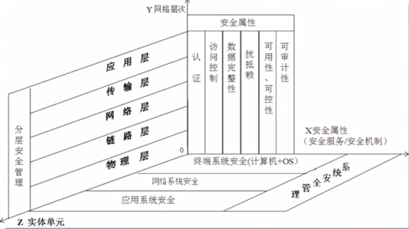
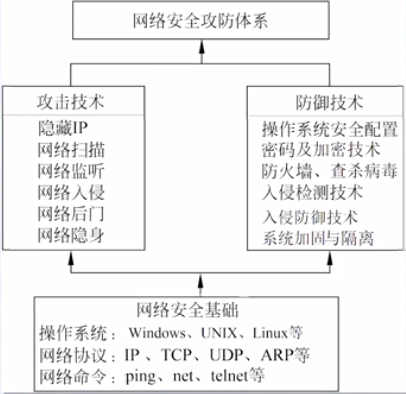
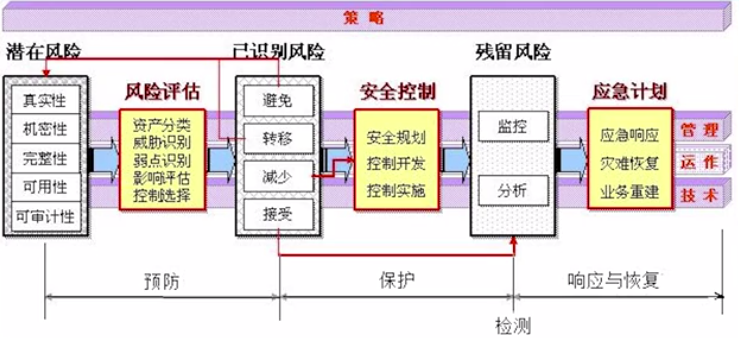
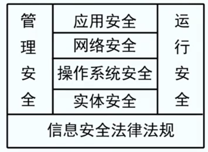
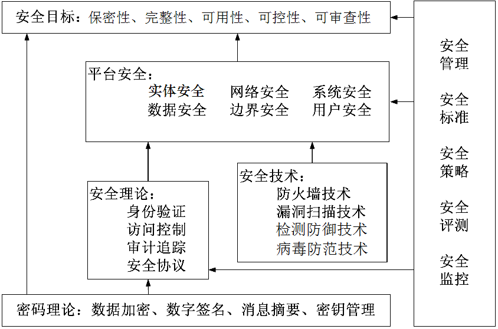
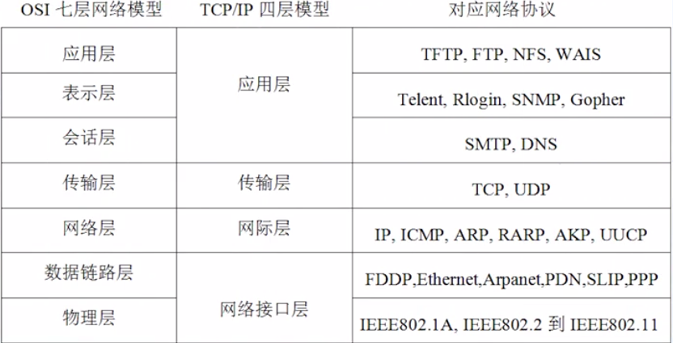
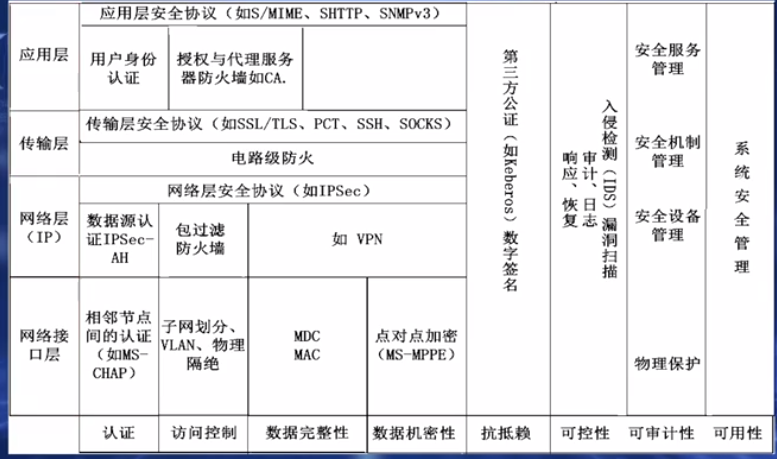
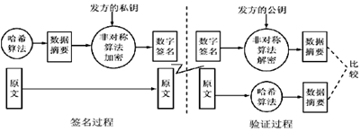

# 网络安全考点

## 网络安全基础

### 网络空间安全概述

威胁的种类：黑客入侵、假冒合法用户、非授权访问、窃听、病毒破坏、干扰系统运行、篡改或破坏等。

攻击：

- 主动攻击
- 被动攻击

风险：

- 网络系统：
  - 开放性隐患多；
  - 网络资源共享风险大；
  - 系统结构复杂及漏洞隐患；
  - 身份验证难；
  - 网络边界难以确定而且容易受到各种不同攻击的威胁；
  - 传输路径与结点隐患多；
  - 信息高度聚集易受攻击；
- 网络服务协议；
- 操作系统：
  - 体系结构和研发漏洞；
  - 创建进程的隐患；
  - 服务及设置的风险；
  - 配置和初始化错误；
- 防火墙的局限性及风险；
- 网络数据库的安全风险；
- 网络安全管理及其他问题；

### 网络空间安全的体系结构

OSI网络安全体系结构：

- 安全机制：加密机制、数字签名、访问控制、数据完整性、鉴别交换机制、信息量填充机制、路由控制机制和公证机制
- 网络安全服务：鉴别服务(包括对用户及传输/接收设备的鉴别认定)、(还有)访问控制服务、数据保密性服务、数据完整性服务和可审查性服务。

TCP/IP网络安全管理体系结构：

网络安全攻防体系结构：

网络安全保障体系：

## 网络空间安全技术基础

### 网络安全技术概述

信息安全：保护信息和信息系统不被未经授权的访问、使用、泄露修改和破坏，为信息和信息系统提供保密性、完整性、可用性、可控性和可审查性。

网络信息安全5大特征（目标）：

- 保密性（有效性）：只被授权对象使用，是防止信息非法泄露的最基本手段；
- 完整性：信息在传输、交换、存储和处理过程中，保持信息不被破坏或随意删改、不丢失和信息未经授权不能改变的特性（最基本的安全特征）；
- 可用性（有效性）：系统运行时正确存取所需信息，当系统遭受意外攻击或破坏时，可以迅速恢复并能投入使用；
- 可控性：指系统对信息内容和传输具有控制能力；
- 可审查性（拒绝否认性、抗抵赖性、不可否认性）：网络通信双方在信息交互过程中，确信参与者本身和所提供的信息真实同一性；

网络安全（狭义）：指利用网络技术、管理和控制等措施，保证 **网络系统** 和 **信息** 的 **保密性、完整性、可用性（网络安全的3基本要求）、可控性和可审查性（网络信息安全5大特征）** 受到保护。

网络空间安全（广义）：保护网络空间中的信息在产生、传输、存储、处理等环节中所面临的威胁和防御措施，以及网络系统本身的威胁和防护机制。

网络安全的内容：

- 实体安全（物理安全）；
- 系统安全：包括网络系统安全、操作系统安全和数据库系统安全；
- 运行安全，网络运行和网络访问控制的安全；
- 应用安全，由应用软件平台安全和应用数据安全两部分组成；
- 其他安全；

网络安全技术：网络安全技术是指所有保护网络安全采取的技术手段、有效措施和机制。网络实体安全、网络系统安全、数据库安全、密码及加密技术、身份认证、访问控制、病毒防范、检测防御、网络安全测评及运行安全，以及安全服务、安全机制和网络安全策略等。

网络安全技术主要可以归纳为三大类：

- 预防保护类；
- 检测跟踪类；
- 响应恢复类；

主要的通用网络安全技术有8种：

- 身份认证；
- 访问管理；
- 加密；
- 防恶意代码；
- 加固；
- 监控；
- 审核跟踪；
- 备份恢复；

网络安全常用模型：

- PDRR模型：防护、检测、响应、恢复；
- 网络安全通用模型；
- 网络安全防御模型；

### 网络协议及无线网络的风险

网络协议的安全风险可归结为3个方面：

- 网络协议（软件）自身的设计缺陷存在安全漏洞；
- 网络协议无有效认证机制，不能验证通信双方真实性；
- 网络协议缺乏保密机制，无法保护网上数据的机密性；

IPv6的安全机制：

- 协议安全：支持数据源发认证、完整性和抗重放攻击等;
- 网络安全：实现端到端安全、提供内网安全、由安全隧道构建安全VPN、以隧道嵌套实现网络安全;
- 其他安全保障;

### 无线网络安全防范

无线网络的安全主要有访问控制和数据加密。

无线局域网安全防范：

- 无线接入点安全：修改admin密码、WEP加密传输、禁用DHCP服务、修改SNMP字符串、禁止远程管理、修改SSID标识、禁止SSID广播、过滤MAC地址、合理放置无线AP、WPA用户认证；
- 无线路由器安全：利用无线AP的安全策略、网络防火墙、IP地址过滤；

IEEE802.1x身份认证：

- 请求者、认证者、认证服务器；

### 常用的网络安全管理工具及应用

常用网络安全管理工具：判断主机是否连通的ping命令,查看IP地址配置情况的ipconfig命令,查看网络连接状态netstat命令,进行网络操作的net命令和行定时器操作的at命令等。

## 密码及加密技术

### 密码技术概述

作用：是可以有效地解决网络安全中的常用的机密性、数据完整性、数字认证、可控性及可审查性等重要的基本需求。

- 密码学：密码编码学和密码分析学的总称，是研究编制密码和破译密码的技术科学。
- 密码编码学：是研究密码编码和加密技术方法及应用的科学;
- 密码分析学：也称为密码破译学是研究密码变化的规律，并应用于破译密码以获取相关情报信息的科学。

密码学研究目的保证数据的保密性、完整性和认证性。

角色：发送方、接收方、入侵者、窃听者。

密码体制：明文（P）、密文（C）、加密（E）算法、解密（D）算法、密钥（K)。

基本工作过程：

- 发送方用加密密钥，通过加密算法，将明文信息加密成密文后发送出去；
- 接收方在收到密文后，用解密密钥，通过解密算法将密文解密，恢复为明文。

密码体制的分类：

- 对称密码体制：加解密算法简单、速度快、密钥简短、适合加密大量文件或数据。密钥安全管理难度大，太多用户使用时密钥组合急剧增长，导致密钥分发管理比较复杂。DES，IDEA，Rijndael，AES，RC4；
- 非对称密码体制（PKI）：加解密算法复杂、安全程度高。加密和解密处理速度比较慢，通常用于对密钥或特殊文件的加密和数字签名。RSA（最著名的公钥密码算法）；
- 混合密码体制；

密码体制的分类（时代）：

- 古典密码体制；
- 现代密码体制；

数据存储加密:

- 系统本身的加密功能加密：依赖系统；
- 密码加密法：读取时加密，没有对文件加密；
- 密钥加密：对文件整体加密；

密码破译方法：

- 穷举搜索密钥攻击；
- 统计分析法；
- 惟密文攻击；
- 已知明文攻击；
- 惟选定明文攻击；
- 选择密文攻击；

防止密码破译：

- 强化加密算法；
- 使用U盾或动态密码；

密钥管理：

- KDC：使用可信第三方来验证通信双方的真实性，产生会话密钥，并通过数字签名等手段分配密钥；
- Diffie-Hellman：通信发起方产生通信会话的私用密钥，并通过数字签名或零知识证明等方式安全传递通信密钥；

网络密钥主要有三种：会话密钥、基本密钥、主密钥。

### 常见加密技术应用

实用密码技术主要包括5种：

- 古典对称密码体制：
  - 代换密码：将明文中的每个元素（字母、比特、比特组合或字母组合）映射为另一个元素；
  - 置换密码：将明文通过置换得到不同的对应；
- 单向加密体制：消息摘要、散列值；
- 无线网络加密技术：WEP加密技术、WPA加密技术、隧道加密技术；
- 实用综合加密；

可信第三方：

- 数字信封；
- 数字签名：
  - 接收者能够核实发送者对信息的签名；
  - 发送者事后不能抵赖对信息的签名；
  - 接收者不能伪造对信息的签名；
- PKI；
- PGP；

## 身份认证与访问控制

### 身份认证技术基础

概念：各种网络系统中的身份认证是对不同用户在进入系统或访问不同保护级别的系统资源时，系统确认该用户的身份是否真实、合法和唯一的过程。

包括：

- 用户本身的；
- 设备的；
- 操作的；

目的：确保网络系统数据（信息）的传输、存储、操作的各种用户身份的真实、合法、唯一。

种类：

- 消息认证：保证信息的完整性和可审查性；
- 身份认证：对用户的真实身份的确认验证；

常用方法：

- 静态密码方式；
- 动态口令认证；
- USB Key认证；
- 生物识别技术；
- CA认证系统：个人或机构证书、服务器证书、代码签名证书等；

CA的主要职能：

1. 管理和维护客户的证书和使用（包括U盾)
2. 维护整个认证过程的安全。
3. 提供网络安全审计的依据〈含电子证据等)。

### 认证系统与数字签名

概念：又称公钥数字签名或电子签章，是以数字形式存储于文件中或相关的信息中，用于验证辨识数据签署人的身份，并表明签署人对数据中所包信息的认可。数字签名技术是将摘要信息用发送者的私钥加密，与原文一起传送给接收者（(并可以由对方分别进行验证)。用于保证文件传输的完整性、发送者的身份认证、防止交易中的抵赖行为发生。

功能：

- 必须可信；
- 无法抵赖；
- 不可伪造；
- 不能重用；
- 不许变更；
- 处理快、应用广；

数字签名算法的主要组成有两部分：签名算法和验证算法。

常用数字签名主要是公钥加密〈非对称加密〉算法的典型应用。

基本原理：采用的是双加密方式，先将原文件用对称密钥加密后传输，并将其密钥用接收方公钥加密发给对方。

数字签名加密，签名验证解密。

过程：

### 访问控制技术

概念：指系统对用户身份及其所属的预先定义的策略组限制其使用数据资源能力的手段。通常用于系统管理员控制用户对服务器、目录、文件等网络资源的访问。

要素：

- 主体；
- 客体；
- 访问策略；

主要功能和作用：

- 保证合法用户提供访问受保护的网络资源；
- 防止非授权用户使用受保护的网络资源；
- 防止合法的用户对受保护的网络资源进行非授权的访问；

访问控制的内容包括认证、控制策略实现和安全审计。

层次：

- 物理访问控制；
- 逻辑访问控制；

类型：

- 自主访问控制（DAC）；
- 强制访问控制（MAC）；
- 基于角色的访问控制（RBAC）；

策略：在某个自治区域内（属于某个组织/机构的一系列处理和通信资源范畴）, 用于所有与安全相关活动的一套访问控制规则。

- 基于身份的安全策略；
- 基于规则的安全策略；
- 综合访问控制策略；

机制：是检测和防止系统未授权访问，并对保护资源所采取的各种措施。是在文件系统中广泛应用的安全防护方法，一般是在操作系统的控制下，按照事先确定的规则决定是否允许主体访问客体，贯穿于系统全过程。

## 防火墙技术

### 防火墙概述

分离器、限制器、分析器。

定义：

- 位于内外网络之间，通过执行访问控制策略保护网络安全的设备；
- 防火墙用来屏蔽、阻拦数据报，只允许授权的数据报通过，以保护网络的安全性；
- 防火墙是内、外部网络通信安全过滤的主要途径，能够根据制定的访问规则对流经它的信息进行监控和审查，从而保护内部网络不受外界的非法访问和攻击；

基本功能：

- 监视点：通过强制所有进出流量通过阻塞点，网络管理员可以集中在较少地方实现安全的目的；
- 保护内网：隔绝内、外网络，保护内部网络；
- 强化网络安全：通过以防火墙为中心的安全方案配置，能将所有的安全软件(如口令、加密、身份认证、审计等)配置在防火墙上；
- 有效记录：有效记录和审计内、外网络之间的活动；

缺点：

- 无法防范不经由防火墙的攻击；
- 是一种被动安全策略执行设备；
- 不能防止利用标准网络协议中的缺陷的攻击；
- 不能防止利用服务器系统漏洞进行的攻击；
- 不能防止数据驱动式的攻击；
- 无法保证准许服务的安全性；
- 不能防止本身的安全漏洞威胁；
- 不能防止感染了病毒的软件或文件的传输；

基本特性：

- 支持内容过滤；
- 支持本地管理和远程管理；
- 日志管理和对日志的统计分析；
- 实时告警功能；
- 能够与入侵检测系统互动；

### 防火墙的类型和应用

防火墙的分类：

- 以软硬类型：
  - 软件防火墙；
  - 硬件防火墙；
  - 芯片级防火墙；
- 以技术：
  - 包过滤型防火墙（网络层）：静态包过滤型防火墙、动态包过滤型防火墙；
  - 应用代理型防火墙（应用层）：应用网关型防火墙、自适应代理型防火墙；
- 以体系结构：
  - 单一主机防火墙；
  - 路由器集成式防火墙；
  - 分布式防火墙；
以性能：
  - 百兆级防火墙；
  - 千兆级防火墙；

防火墙的主要应用：

企业网络的体系结构、内部防火墙系统应用、外围防火墙设计。

内部防火墙系统应用：控制对内部网络的访问以及从内部网络进行访问。

用户类型：完全信任用户、部分信任用户、不信任用户。

### 入侵检测系统与防御系统概述

入侵检测系统是一种积极主动的网络安全防护工具，它通过对网络中所有传输的数据进行智能分析和检测，从中发现网络或系统中是否有违反安全策略的行为和被攻击的迹象，在网络系统受到危害之前拦截和阻止入侵。

## 计算机及手机病毒防范

### 计算机及手机病毒基础

概念：是指编制或者在计算机程序中插入的破坏系统功能或者毁坏数据，影响系统使用，并能自我复制的一组指令或者程序代亿。

产生：恶作剧型、报复心理型、版权保护型、特殊目的型。

发展阶段：

- 原始病毒阶段（第一阶段）；
- 混合型病毒阶段（第二阶段)；
- 多态型病毒阶段（第三阶段）；
- 网络病毒阶段（第四阶段)；
- 主动攻击型病毒阶段（第五阶段)；

特点：

- 传播性；
- 隐蔽性；
- 潜伏性；
- 触发及控制性；
- 影响破坏性；
- 多态及不可预见性；

种类：

- 以操作系统；
- 以攻击机型；
- 以链接方式：
  - 源码型病毒；
  - 嵌入型病毒；
  - 外壳型病毒；
  - 操作系统型病毒；
- 以破坏能力：
  - 无害型；
  - 轻微危害型；
  - 危害型；
  - 非常危害型；
- 以传播媒介：
  - 单机病毒；
  - 网络病毒；
- 以传播方式：
  - 引导型病毒；
  - 文件型病毒；
  - 混合型病毒；
- 以算法：
  - 伴随型病毒；
  - 蠕虫型病毒；
  - 寄生型病毒；
  - 练习型病毒；
  - 诡秘型病毒；
  - 幽灵型病毒；
- 以寄生部位：
  - 磁盘引导区传染的病毒；
  - 操作系统传染的病毒；
  - 可执行程序传染的病毒；
- 以激活时间：
  - 定时病毒；
  - 随机病毒；

### 病毒表现现象及危害

危害：

- 破坏系统、文件和数据；
- 窃取机密文件和信息；
- 造成网络堵塞或瘫痪；
- 消耗内存、磁盘空间和系统资源；
- 电脑（网络系统）运行缓慢；
- 时间、精力、经济上的损失对用户造成心理压力；

症状：

- 系统运行速度变慢；
- 无法上网；
- 无故自动弹出对话框或网页；
- 用户名和密码等用户信息被篡改；
- 甚至是死机，系统瘫痪等；

### 计算机病毒的构成与传播

构成：

- 触发单元：触发控制部分、影响破坏操作部分；
- 引导单元；
- 传染单元：传染空制模块、传染判断模块、传染操作模块；

传播：

- 通过移动存储介质（主流）；
- 通过各种网络通道；

过程：制作-传播-潜伏-触发-运行-实行攻击。

生存周期：开发期、传播期、潜伏期、发作期、发现期、消化期、消亡期。

### 计算机病毒的检测清除与防范

检测：

- 异常现象：
  - 系统运行异常；
  - 屏幕显示异常；
  - 声音播放异常；
  - 文件、系统异常；
  - 外设异常；
  - 网络异常；
- 专业工具：
  - 病毒标记法；

清除：

- 杀毒软件；
- 重装；

预防：

- 定期备份系统数据文件；
- 外部存储设备连接前先杀毒再使用；
- 不访问违法或不明网站；
- 不下载传播不良文件；
- 不连接未知的WiFi；
- 不随意扫描二维码等；

## 黑客攻防与检测防御

### 黑客概念及攻击途径

概念：主要泛指具有一定计算机等相关技术特长，并通过各种不正当的手段躲过网络系统安全措施，进人他人的网络系统进行非授权活动的人。

攻击途径：

- 网络系统的漏洞：系统研发的缺陷、网络协议的缺陷、系统配置不当、系统安全管理的漏洞
- 网路及系统的端口

### 黑客攻击的目的及过程

目的：

- 利益；
- 精神需求；

步骤：

- 隐藏IP地址；
- 踩点扫描；
- 篡权攻击；
- 种植后门；
- 隐身退出；

种类：

- 阻塞类；
- 探测类：网络扫描探测、体系结构探测、系统信息收集等；
- 控制类：口令攻击、木马攻击、缓冲区溢出攻击；
- 欺骗类：IP(地址)欺骗、虚假消息攻击；
- 漏洞类；
- 破坏类；

### 常用的黑客攻防技术

端口扫描：

- 用于对获取的数据和系统安全的分析，帮助查找漏洞和隐患，便于系统加固。
- 探寻攻击目标。端口扫描的方式利用命令扫描或扫描工具。

端口扫描防范：

- 做好系统加固；
- 及时发现问题端口；
- 及时关闭不用的端口；

网络监听：

- 又称为网络嗅探，是指通过各种技术手段监视网络通信，并截获网上有关信息的一种方法；
- 用于检测网络异常等；
- 获取网上窃取传输信息进而实施攻击的重要手段；

网络监听防范：

- 通过网络分段将非法用户操作与机密网络资源进行隔离，防止可能的非法监听和网络广播风暴；
- 以交换式集线器代替共享式集线器；
- 使用加密技术；
- 运用虚拟局域网技术；
- 使用U盾或动态口令；

口令密码攻击方法：

- 暴力攻击；
- 字典攻击；

缓冲区溢出：

- 指当计算机向缓冲区内存储调人填充数据时，超过了缓冲区限定的容量，可以导致程序运行失败、系统关机、重新启动、或数据被覆盖等后果。

拒绝服务：

- (DoS)是指黑客利用合理的服务请求或垃圾邮件等占用过多服务资源，使合法用户无法得到正常服务直至系统瘫痪的攻击方式；
- 分布式拒绝服务攻击(DDoS）是利用更多的傀儡机（黑客控制的肉鸡)构成的僵尸网络（也称受控网络)发起更大规模的攻击；

木马：

- 是一种利用利用具有远程访问和控制功能的病毒软件，对用户进行的远程攻击；
- 步骤：配置木马、传播木马、运行木马、泄露信息、建立连接、远程控制；
